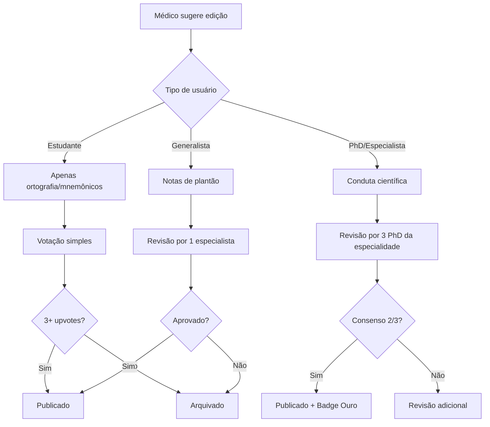

# 🧠 MedFocus PhD - Especificação Técnica Completa V2.0

> **Terminal de Inteligência Clínica de Próxima Geração**
> 
> Objetivo: Superar o Whitebook tornando-se a plataforma indispensável para estudantes de medicina e PhDs
> 
> Data: Fevereiro 2026  
> Versão: 2.0 - Especificação Técnica Profunda  
> Stack: Google Cloud Platform (GCP) + Flutter + Firebase + Vertex AI

---

## 📋 Índice Executivo

1. [Visão de Produto](#visão-de-produto)
2. [Arquitetura GCP](#arquitetura-gcp)
3. [Modelo de Dados](#modelo-de-dados)
4. [Especificação de Telas](#especificação-de-telas)
5. [Sistema de Reputação](#sistema-de-reputação)
6. [Gamificação e Retenção](#gamificação-e-retenção)
7. [Integrações e APIs](#integrações-e-apis)
8. [Roadmap de Desenvolvimento](#roadmap-de-desenvolvimento)
9. [Estratégia de Go-to-Market](#estratégia-de-go-to-market)
10. [Métricas de Sucesso](#métricas-de-sucesso)

---

## 🎯 Visão de Produto

### O Problema

**Whitebook:** Dicionário médico estático, sem inteligência contextual, sem colaboração real, sem preparação para residência.

**Gap do Mercado:**
- ❌ Não há busca semântica (busca por palavras-chave literal)
- ❌ Não prepara para provas de residência
- ❌ Não integra com workflow do estudante (Anki, Notion)
- ❌ Não auxilia no round médico
- ❌ Não diferencia estudante vs PhD vs médico
- ❌ Sem gamificação ou incentivo ao uso contínuo

### A Solução: MedFocus PhD

**Terminal de Inteligência Clínica em 3 Camadas:**

#### **Camada 1: Plantão (The Essentials)**
- **Público:** Estudantes de graduação, internos, médicos generalistas
- **Conteúdo:** Doses, condutas essenciais, fluxogramas de emergência
- **Tecnologia:** Offline-first (SQLite local), latência < 50ms
- **UX:** Cards coloridos, checklists interativos, modo escuro

#### **Camada 2: Especialista (The Deep Dive)**
- **Público:** Residentes, especialistas, médicos experientes
- **Conteúdo:** Fisiopatologia avançada, exames complementares, diagnóstico diferencial
- **Tecnologia:** Hybrid (cache + cloud), imagens médicas, calculadoras
- **UX:** Texto acadêmico estruturado, diagramas interativos

#### **Camada 3: PhD/Frontier (The Researcher)**
- **Público:** PhDs, pesquisadores, professores universitários
- **Conteúdo:** Últimos trials, gaps de pesquisa, mecanismos moleculares
- **Tecnologia:** RAG (Retrieval-Augmented Generation), Vector Search
- **UX:** Citações diretas, exportação BibTeX/RIS, discussões científicas

### Diferenciais Estratégicos

| Funcionalidade | MedFocus PhD | Whitebook | AMBOSS | UpToDate |
|----------------|--------------|-----------|---------|----------|
| **Busca Semântica (IA)** | ✅✅✅ | ❌ | ⚠️ | ⚠️ |
| **3 Camadas (Graduação → PhD)** | ✅✅✅ | ❌ | ❌ | ⚠️ |
| **Modo Round Médico** | ✅✅✅ | ❌ | ❌ | ❌ |
| **Integração Anki/Notion** | ✅✅✅ | ❌ | ⚠️ | ❌ |
| **Questões de Residência** | ✅✅✅ | ❌ | ✅✅ | ❌ |
| **Colaboração Wiki** | ✅✅✅ | ❌ | ❌ | ❌ |
| **Exportação Acadêmica** | ✅✅✅ | ❌ | ⚠️ | ✅ |
| **Gamificação** | ✅✅✅ | ❌ | ⚠️ | ❌ |
| **Preço para Estudante** | 💵 (low) | 💵💵 | 💵💵💵 | 💵💵💵💵 |

---

## 🏗️ Arquitetura GCP

### Visão Geral da Stack

```
┌─────────────────────────────────────────────────────────────┐
│                    FRONTEND (Multi-platform)                 │
├─────────────────────────────────────────────────────────────┤
│  Flutter Mobile (iOS/Android) │ React Web │ Browser Extension│
└───────────────────┬─────────────────────────────────────────┘
                    │
                    ▼
┌─────────────────────────────────────────────────────────────┐
│                    API GATEWAY (Cloud Run)                   │
├─────────────────────────────────────────────────────────────┤
│              Load Balancer + Rate Limiting                   │
└───────────────────┬─────────────────────────────────────────┘
                    │
    ┌───────────────┼───────────────┐
    ▼               ▼               ▼
┌─────────┐   ┌──────────┐   ┌──────────────┐
│ Auth    │   │ Content  │   │ Intelligence │
│ Service │   │ Service  │   │ Service      │
└─────────┘   └──────────┘   └──────────────┘
    │             │                 │
    │             │                 │
    ▼             ▼                 ▼
┌─────────────────────────────────────────────┐
│           DATA LAYER (GCP)                  │
├─────────────────────────────────────────────┤
│ • Firestore (Real-time DB)                  │
│ • Cloud SQL (PostgreSQL) - Analytics        │
│ • BigQuery - Data Lakehouse                 │
│ • Vertex AI Vector Search - Embeddings      │
│ • Cloud Storage - Assets (images, PDFs)     │
└─────────────────────────────────────────────┘
          │
          ▼
┌─────────────────────────────────────────────┐
│      EXTERNAL INTEGRATIONS                  │
├─────────────────────────────────────────────┤
│ • ANVISA (dados.gov.br)                     │
│ • OpenFDA (api.fda.gov)                     │
│ • PubMed (NCBI E-utilities)                 │
│ • Sociedades Médicas (RSS/PDF Parsing)      │
└─────────────────────────────────────────────┘
```

### Microserviços Principais

#### 1. **Auth Service** (Cloud Run)
**Responsabilidade:** Autenticação, autorização, gestão de perfis

**Stack:**
- Node.js + TypeScript
- Firebase Authentication
- JWT + OAuth 2.0
- CRM verification

**Endpoints:**
```typescript
POST   /api/auth/register          // Cadastro com verificação CRM
POST   /api/auth/login             // Login (email/password ou OAuth)
POST   /api/auth/verify-crm        // Verificação de CRM (integração CFM)
GET    /api/auth/me                // Perfil do usuário
PATCH  /api/auth/profile           // Atualizar perfil
POST   /api/auth/upgrade-to-phd    // Upgrade para tier PhD
```

**Níveis de Acesso:**
```typescript
enum UserTier {
  STUDENT = 'student',           // Camada 1 + preview Camada 2
  RESIDENT = 'resident',         // Camada 1 + 2 completa
  SPECIALIST = 'specialist',     // Camada 1 + 2 + preview Camada 3
  PHD = 'phd',                   // Acesso completo (1 + 2 + 3)
  CURATOR = 'curator'            // PhD + permissões de edição
}
```

---

#### 2. **Content Service** (Cloud Run)
**Responsabilidade:** CRUD de condutas médicas, busca semântica, versionamento

**Stack:**
- Node.js + TypeScript
- Firestore (primary database)
- Vertex AI Vector Search (semantic search)
- Cloud Storage (PDFs, images)

**Endpoints:**
```typescript
// Busca e listagem
GET    /api/content/search                 // Busca semântica multi-camada
GET    /api/content/diseases               // Listar doenças
GET    /api/content/diseases/:id           // Detalhes de uma doença
GET    /api/content/diseases/:id/layer/:tier  // Obter camada específica

// Calculadoras e ferramentas
GET    /api/content/calculators            // Listar calculadoras
POST   /api/content/calculators/:id/calc   // Executar cálculo

// Drug database
GET    /api/content/drugs                  // Buscar medicamentos
GET    /api/content/drugs/:id              // Detalhes de medicamento
POST   /api/content/drugs/interactions     // Checker de interações

// Imagens médicas
GET    /api/content/images                 // Atlas de imagens
GET    /api/content/images/:id             // Detalhes de imagem
```

**Busca Semântica (Vertex AI):**
```typescript
// Processo de busca
1. Query do usuário: "cansaço ao subir escada"
2. Embedding via Vertex AI text-embedding-005
3. Vector search em Vertex AI Vector Search
4. Retorna top 10 doenças por similaridade
5. Re-ranking por tier do usuário
6. Highlight de termos relevantes
```

---

#### 3. **Intelligence Service** (Cloud Run)
**Responsabilidade:** IA generativa, RAG, resumos, citações

**Stack:**
- Python (FastAPI)
- Vertex AI Gemini Pro 1.5
- LangChain
- BigQuery (knowledge base)

**Endpoints:**
```typescript
// RAG e geração
POST   /api/intelligence/ask              // Pergunta livre (RAG)
POST   /api/intelligence/summarize        // Resumir conduta
POST   /api/intelligence/generate-pitch   // "Modo Preceptor" (resumo 30s)
POST   /api/intelligence/flashcards       // Gerar flashcards de conteúdo
POST   /api/intelligence/quiz             // Gerar quiz adaptativo

// Análise de imagem (Google Lens)
POST   /api/intelligence/analyze-image    // ECG, Rx, exames
POST   /api/intelligence/spot-diagnosis   // Quiz de imagem

// Citações e referências
POST   /api/intelligence/export-citation  // Exportar BibTeX/RIS/ABNT
GET    /api/intelligence/related-papers   // Artigos relacionados (PubMed)
```

**RAG Architecture:**
```python
# LangChain RAG Pipeline
1. User Query → Gemini Embedding
2. Vector Search em BigQuery (top 5 documentos)
3. Prompt Engineering:
   - System: "Você é um assistente médico baseado em evidências"
   - Context: [Documentos recuperados]
   - Query: [Pergunta do usuário]
4. Gemini Pro 1.5 → Resposta
5. Citation tracking (fonte de cada afirmação)
```

---

#### 4. **Collaboration Service** (Cloud Run)
**Responsabilidade:** Wiki médica, votação, reputação

**Stack:**
- Node.js + TypeScript
- Firestore (real-time)
- Cloud Tasks (async jobs)

**Endpoints:**
```typescript
// Contribuições
POST   /api/collab/suggest-edit           // Sugerir edição em conduta
POST   /api/collab/vote                   // Votar em sugestão
GET    /api/collab/pending-reviews        // Sugestões pendentes
POST   /api/collab/approve                // Aprovar sugestão (curator)

// Discussões
POST   /api/collab/threads                // Criar thread de discussão
POST   /api/collab/threads/:id/replies    // Responder thread
POST   /api/collab/threads/:id/upvote     // Upvote

// Reputação
GET    /api/collab/reputation/:userId     // Score de reputação
GET    /api/collab/leaderboard            // Top contributors
```

**Medical Trust Score (MTS):**
```typescript
interface ReputationScore {
  user_id: string;
  tier: UserTier;
  total_score: number;
  
  contributions: {
    edits_approved: number;      // Peso: 10 pontos
    edits_rejected: number;      // Peso: -5 pontos
    discussions_created: number; // Peso: 2 pontos
    upvotes_received: number;    // Peso: 1 ponto
    papers_submitted: number;    // Peso: 15 pontos
  };
  
  badges: string[];              // "PhD Verificado", "Curador Ouro"
  authority_level: number;       // 1-10 (usado para peso de voto)
}

// Algoritmo de Trust Score
function calculateMTS(user: User, contributions: Contributions): number {
  let score = 0;
  
  // Base por tier
  const tierBonus = {
    student: 10,
    resident: 50,
    specialist: 100,
    phd: 200,
    curator: 500
  };
  score += tierBonus[user.tier];
  
  // Contribuições
  score += contributions.edits_approved * 10;
  score -= contributions.edits_rejected * 5;
  score += contributions.discussions_created * 2;
  score += contributions.upvotes_received * 1;
  score += contributions.papers_submitted * 15;
  
  // Penalty por inatividade (30 dias sem contribuir = -10%)
  const daysSinceLastContribution = 
    (Date.now() - user.last_contribution) / (1000 * 60 * 60 * 24);
  if (daysSinceLastContribution > 30) {
    score *= 0.9;
  }
  
  return Math.max(0, score);
}
```

---

#### 5. **Analytics Service** (Cloud Run)
**Responsabilidade:** Tracking, métricas, predições

**Stack:**
- Python (FastAPI)
- BigQuery (data warehouse)
- Looker Studio (dashboards)
- Vertex AI AutoML (predições)

**Endpoints:**
```typescript
// Tracking
POST   /api/analytics/event               // Registrar evento
POST   /api/analytics/session             // Session tracking

// Métricas pessoais
GET    /api/analytics/user/:id/stats      // Estatísticas do usuário
GET    /api/analytics/user/:id/weak-areas // Áreas de dificuldade
GET    /api/analytics/user/:id/prediction // Predição de performance

// Dashboards
GET    /api/analytics/global/stats        // Estatísticas globais
GET    /api/analytics/content/popular     // Conteúdos mais acessados
```

---

### Data Pipeline (Cloud Functions + Scheduler)

#### Ingestão Automática de Dados

```yaml
# Cloud Scheduler Jobs (cron)

1. ANVISA Scraper (a cada 6 horas)
   Schedule: "0 */6 * * *"
   Function: ingest-anvisa
   Tasks:
     - Baixar dataset de medicamentos (dados.gov.br)
     - Comparar com versão anterior
     - Detectar mudanças (novos medicamentos, preços, alertas)
     - Atualizar Firestore + BigQuery
     - Enviar notificação se houver alerta crítico

2. PubMed Scraper (diário às 02:00)
   Schedule: "0 2 * * *"
   Function: ingest-pubmed
   Tasks:
     - Query por keywords high-impact:
       * "Randomized Controlled Trial"[PT] AND "New Drug Application"
       * Filtros: Journal Impact Factor > 10, Last 7 days
     - Para cada artigo:
       * Extrair abstract, metadata, DOI
       * Gerar embedding (Vertex AI)
       * Armazenar em Vector Search
       * Linkar com doenças relevantes (ML)

3. FDA Alerts (a cada 3 horas)
   Schedule: "0 */3 * * *"
   Function: ingest-fda
   Tasks:
     - Consumir api.fda.gov/drug/label.json
     - Detectar "Black Box Warnings" novos
     - Cross-reference com medicamentos no Brasil
     - Push notification para usuários afetados

4. Sociedades Médicas (semanal, domingo 00:00)
   Schedule: "0 0 * * 0"
   Function: ingest-guidelines
   Tasks:
     - Parsear PDFs de diretrizes (SBC, SBPT, AHA, ESC)
     - Vertex AI Document AI (OCR + structure)
     - Extrair recomendações (classe I, IIa, IIb, III)
     - Atualizar condutas correspondentes
```

**Cloud Function Example (ANVISA):**
```typescript
// functions/ingest-anvisa/index.ts
import { BigQuery } from '@google-cloud/bigquery';
import { Firestore } from '@google-cloud/firestore';
import axios from 'axios';

const ANVISA_API = 'https://dados.gov.br/api/3/action/datastore_search';
const DATASET = 'medicamentos-registrados';

export async function ingestAnvisa() {
  const bigquery = new BigQuery();
  const firestore = new Firestore();
  
  // 1. Baixar dados da ANVISA
  const response = await axios.get(ANVISA_API, {
    params: { resource_id: DATASET, limit: 10000 }
  });
  
  const medications = response.data.result.records;
  
  // 2. Comparar com versão anterior
  const previousSnapshot = await bigquery
    .dataset('medfocus')
    .table('anvisa_medications')
    .getRows();
  
  const changes = detectChanges(medications, previousSnapshot);
  
  // 3. Atualizar Firestore (real-time)
  const batch = firestore.batch();
  changes.new.forEach(med => {
    const ref = firestore.collection('medications').doc(med.registro);
    batch.set(ref, med);
  });
  await batch.commit();
  
  // 4. Atualizar BigQuery (analytics)
  await bigquery
    .dataset('medfocus')
    .table('anvisa_medications')
    .insert(medications);
  
  // 5. Notificações de alertas críticos
  const criticalAlerts = changes.alerts.filter(a => a.severity === 'high');
  if (criticalAlerts.length > 0) {
    await sendNotifications(criticalAlerts);
  }
  
  return { 
    processed: medications.length, 
    changes: changes.new.length,
    alerts: criticalAlerts.length 
  };
}
```

---

## 💾 Modelo de Dados

### Firestore Schema (NoSQL)

#### Collection: `diseases`

```typescript
interface Disease {
  // Identificação
  id: string;                    // "ic-001"
  name: string;                  // "Insuficiência Cardíaca FEr"
  name_variations: string[];     // ["ICFEr", "IC com FE reduzida"]
  cid10: string[];               // ["I50.0", "I50.1"]
  cid11: string[];               // ["BD10.Z"]
  
  // Metadados
  category: string;              // "Cardiologia"
  specialty: string[];           // ["Cardiologia", "Clínica Médica"]
  prevalence: string;            // "Alta"
  urgency_level: number;         // 1-5 (5 = emergência)
  
  // Camadas de conteúdo
  layers: {
    // Camada 1: Plantão
    essentials: {
      summary: string;                    // Resumo em tópicos
      mnemonic: string;                   // "MOVE"
      emergency_protocol: {
        steps: Array<{
          order: number;
          action: string;
          rationale: string;
        }>;
        contraindications: string[];
      };
      prescriptions: Array<{
        drug: string;
        dose: string;
        route: string;
        frequency: string;
        duration: string;
        notes: string;
      }>;
      calculators: string[];              // IDs de calculadoras relacionadas
      available_offline: boolean;         // true
    };
    
    // Camada 2: Especialista
    specialist: {
      pathophysiology: string;            // Texto acadêmico
      diagnostic_criteria: {
        major: string[];
        minor: string[];
        algorithm: string;                // URL do fluxograma
      };
      differential_diagnosis: Array<{
        disease: string;
        distinguishing_features: string[];
      }>;
      exams: {
        gold_standard: string[];
        complementary: string[];
        interpretation: Record<string, string>;
      };
      treatment_details: {
        first_line: string[];
        second_line: string[];
        adjuvant: string[];
        dose_adjustments: Record<string, string>;
      };
      prognosis: string;
      complications: string[];
      images: Array<{                     // Imagens de exames
        type: string;                     // "ECG", "RX", "ECO"
        url: string;
        caption: string;
        annotations: string[];
      }>;
    };
    
    // Camada 3: PhD/Frontier
    phd_frontier: {
      recent_trials: Array<{
        name: string;                     // "EMPEROR-Preserved"
        year: number;
        n: number;                        // Sample size
        primary_outcome: string;
        result: string;
        link: string;                     // PubMed ID
      }>;
      research_gaps: string[];            // Áreas sem evidência robusta
      molecular_mechanisms: {
        pathway: string;                  // URL do diagrama interativo
        key_proteins: string[];
        drug_targets: string[];
      };
      controversies: Array<{
        topic: string;
        evidence_for: string[];
        evidence_against: string[];
      }>;
      future_directions: string[];
    };
  };
  
  // Colaboração
  collaboration: {
    curator: string;                      // User ID do curador responsável
    last_updated: Timestamp;
    last_editor: string;
    version: number;
    community_notes: Array<{
      id: string;
      author: string;
      crm: string;
      specialty: string;
      note: string;
      upvotes: number;
      downvotes: number;
      created_at: Timestamp;
    }>;
    pending_edits: Array<{
      id: string;
      author: string;
      field: string;                      // Path do campo (ex: "layers.essentials.summary")
      old_value: any;
      new_value: any;
      rationale: string;
      votes_for: number;
      votes_against: number;
      status: 'pending' | 'approved' | 'rejected';
    }>;
  };
  
  // Referências acadêmicas
  references: Array<{
    id: string;
    type: 'guideline' | 'trial' | 'review' | 'textbook';
    title: string;
    authors: string[];
    journal: string;
    year: number;
    doi: string;
    pmid: string;
    url: string;
    impact_factor: number;
    tier: 'gold' | 'silver' | 'bronze';   // Qualidade da fonte
    citation_abnt: string;
    citation_vancouver: string;
    citation_bibtex: string;
  }>;
  
  // SEO e busca
  search_keywords: string[];              // Para busca textual
  embedding_vector: number[];             // Para busca semântica (384 dims)
  
  // Analytics
  stats: {
    views: number;
    unique_users: number;
    avg_time_on_page: number;
    bookmarks: number;
    shares: number;
    questions_asked: number;              // Via RAG
  };
}
```

---

#### Collection: `medications`

```typescript
interface Medication {
  // Identificação
  id: string;
  generic_name: string;              // "Furosemida"
  brand_names: string[];             // ["Lasix", "Furosemida EMS"]
  anvisa_registration: string;
  
  // Classificação
  therapeutic_class: string;         // "Diurético de alça"
  atc_code: string;                  // "C03CA01"
  controlled_substance: boolean;
  
  // Farmacologia
  mechanism_of_action: string;
  pharmacokinetics: {
    absorption: string;
    distribution: string;
    metabolism: string;
    elimination: string;
    half_life: string;
  };
  
  // Uso clínico
  indications: Array<{
    disease: string;                 // Link para disease ID
    on_label: boolean;
    evidence_level: string;          // "A", "B", "C"
  }>;
  contraindications: {
    absolute: string[];
    relative: string[];
  };
  
  // Doses
  dosing: Array<{
    indication: string;
    route: 'IV' | 'VO' | 'IM' | 'SC' | 'SL' | 'Tópico';
    adult_dose: string;
    pediatric_dose: string;           // Por kg
    elderly_adjustment: string;
    renal_adjustment: Record<string, string>;  // CrCl ranges
    hepatic_adjustment: Record<string, string>;
    max_dose: string;
  }>;
  
  // Segurança
  adverse_effects: Array<{
    effect: string;
    frequency: string;               // "Comum (1-10%)", "Raro (<1%)"
    severity: 'mild' | 'moderate' | 'severe';
  }>;
  black_box_warnings: string[];      // Avisos críticos FDA
  pregnancy_category: string;        // "B", "C", "D", "X"
  lactation_safety: string;
  
  // Interações
  interactions: Array<{
    drug: string;
    severity: 'minor' | 'moderate' | 'major';
    mechanism: string;
    management: string;
  }>;
  
  // Monitoramento
  monitoring: {
    labs: string[];                  // ["Potássio sérico", "Creatinina"]
    frequency: string;
    target_range: Record<string, string>;
  };
  
  // Comercial
  presentations: Array<{
    form: string;                    // "Comprimido", "Ampola"
    strength: string;                // "40mg"
    packaging: string;               // "Caixa com 20 comprimidos"
    price_range: string;             // "R$ 10-25"
  }>;
  generic_available: boolean;
  sus_availability: boolean;
  
  // Metadata
  last_updated: Timestamp;
  source: string;                    // "ANVISA", "FDA", "Manual"
  references: string[];              // PMIDs
}
```

---

#### Collection: `calculators`

```typescript
interface Calculator {
  id: string;
  name: string;                      // "CHA2DS2-VASc Score"
  category: string;                  // "Cardiologia"
  description: string;
  indication: string;                // Quando usar
  
  // Inputs
  inputs: Array<{
    id: string;
    label: string;
    type: 'number' | 'boolean' | 'select' | 'radio';
    options?: Array<{ value: any; label: string }>;
    unit?: string;
    required: boolean;
    validation?: {
      min?: number;
      max?: number;
      step?: number;
    };
  }>;
  
  // Fórmula
  formula: string;                   // Expressão matemática ou função
  formula_code: string;              // Código TypeScript/Python
  
  // Output
  result: {
    unit: string;
    interpretation: Array<{
      range: string;                 // "0-1", "2-4", ">=5"
      meaning: string;
      risk_level: 'low' | 'moderate' | 'high';
      recommendation: string;
    }>;
  };
  
  // Evidências
  validation_studies: Array<{
    name: string;
    n: number;
    sensitivity: number;
    specificity: number;
    auc: number;
    reference: string;               // PMID
  }>;
  
  // Metadata
  tags: string[];
  related_diseases: string[];        // IDs de doenças
  related_calculators: string[];
  usage_count: number;
  avg_rating: number;
}
```

---

#### Collection: `user_progress`

```typescript
interface UserProgress {
  user_id: string;
  
  // Gamificação
  xp: number;
  level: number;
  streak_days: number;
  badges: Array<{
    id: string;
    name: string;
    icon: string;
    earned_at: Timestamp;
  }>;
  
  // Conteúdo
  diseases_viewed: string[];
  medications_searched: string[];
  calculators_used: Record<string, number>;  // calculator_id → count
  bookmarks: string[];
  
  // Estudo
  flashcards_created: number;
  flashcards_reviewed_today: number;
  quizzes_attempted: number;
  quizzes_accuracy: number;
  
  // Residência
  residency_questions: {
    attempted: number;
    correct: number;
    by_specialty: Record<string, {
      attempted: number;
      correct: number;
    }>;
  };
  
  // Modo Round
  rounds_prepared: number;           // Quantas vezes usou "Modo Preceptor"
  avg_round_score: number;           // Feedback do preceptor (1-5)
  
  // Colaboração
  contributions: {
    edits_suggested: number;
    edits_approved: number;
    discussions_created: number;
    upvotes_received: number;
  };
  reputation_score: number;          // MTS
  
  // Analytics
  weak_areas: string[];              // Especialidades com baixo desempenho
  predicted_enare_score: number;     // ML prediction (0-100)
  study_time_total: number;          // Minutos
  last_active: Timestamp;
}
```

---

### BigQuery Schema (Analytics)

#### Table: `medfocus.events`

```sql
CREATE TABLE medfocus.events (
  event_id STRING NOT NULL,
  user_id STRING,
  event_type STRING NOT NULL,  -- 'page_view', 'search', 'calculator_use', etc.
  event_timestamp TIMESTAMP NOT NULL,
  
  -- Contexto
  platform STRING,              -- 'mobile', 'web', 'extension'
  device_type STRING,
  os STRING,
  app_version STRING,
  
  -- Dados específicos do evento (JSON)
  event_params JSON,
  
  -- Sessão
  session_id STRING,
  session_duration INT64,
  
  -- Geo
  country STRING,
  state STRING,
  city STRING,
  
  -- Particionamento
  event_date DATE
)
PARTITION BY event_date
CLUSTER BY user_id, event_type;
```

#### Table: `medfocus.user_metrics`

```sql
CREATE TABLE medfocus.user_metrics (
  user_id STRING NOT NULL,
  date DATE NOT NULL,
  
  -- Engagement
  sessions INT64,
  avg_session_duration FLOAT64,
  pages_viewed INT64,
  
  -- Conteúdo
  diseases_viewed INT64,
  medications_searched INT64,
  calculators_used INT64,
  
  -- Estudo
  flashcards_reviewed INT64,
  quizzes_attempted INT64,
  quiz_accuracy FLOAT64,
  
  -- Gamificação
  xp_earned INT64,
  streak_maintained BOOL,
  
  -- Colaboração
  edits_suggested INT64,
  discussions_participated INT64
)
PARTITION BY date
CLUSTER BY user_id;
```

---

## 🎨 Especificação de Telas

### 1. **Tela: Cockpit (Home Híbrida)**

**Objetivo:** Hub central com busca universal e acesso rápido

**Layout:**
```
┌─────────────────────────────────────────────────┐
│  [Logo MedFocus PhD]        [Perfil] [⚙️]      │
├─────────────────────────────────────────────────┤
│                                                 │
│  🔍 [Busca Universal_____________________] 🎤  │
│     "Paciente 70a, IC, dose de Sacubitril?"    │
│                                                 │
├─────────────────────────────────────────────────┤
│  ⚡ Acesso Rápido                               │
│  ┌─────┐  ┌─────┐  ┌─────┐  ┌─────┐           │
│  │ 🧮  │  │ 💊  │  │ 📋  │  │ 🎯  │           │
│  │Calc │  │Drug │  │CID  │  │Quiz │           │
│  └─────┘  └─────┘  └─────┘  └─────┘           │
├─────────────────────────────────────────────────┤
│  📰 Tendências na Cardiologia                   │
│  • Nova diretriz AHA 2026 - IC                  │
│  • Trial EMPEROR-HF: Resultados 5 anos          │
│  • Alerta ANVISA: Recall de Losartana           │
├─────────────────────────────────────────────────┤
│  📊 Seu Progresso Hoje                          │
│  🔥 Streak: 15 dias  |  ⭐ XP: 2450 (+50)      │
│  📚 2 condutas estudadas | 🎯 3 quizzes feitos │
└─────────────────────────────────────────────────┘
```

**Componentes:**

**A. Busca Universal**
- Input com NLP (Natural Language Processing)
- Autocomplete inteligente
- Voice search (🎤)
- Sugestões contextuais

**Exemplos de queries:**
- "Dose de furosemida em IC"
- "Contraindicações de metformina"
- "Sinais vitais para sepse"
- "Como fazer punção lombar" → Abre vídeo + protocolo

**B. Cards de Tendência**
- Personalizado por especialidade
- RSS feeds de sociedades médicas
- Alertas da ANVISA/FDA
- Últimos trials do PubMed

**C. Gamificação Visível**
- Streak counter (🔥)
- XP bar com progresso para próximo nível
- Notificação de badges ganhos

---

### 2. **Tela: Visão em Camadas (Conduta Médica)**

**Objetivo:** Exibir conteúdo progressivo com toggle de complexidade

**Layout:**
```
┌─────────────────────────────────────────────────┐
│  ← Voltar     Insuficiência Cardíaca FEr        │
│  [CID10: I50.0]                                 │
├─────────────────────────────────────────────────┤
│  Toggle de Camada:                              │
│  ┌───────┬───────────┬──────────┐               │
│  │🚨 1   │📚 2       │🔬 3      │               │
│  │Plantão│Especialist│PhD       │               │
│  └───────┴───────────┴──────────┘               │
├─────────────────────────────────────────────────┤
│                                                 │
│  [CONTEÚDO DINÂMICO BASEADO NA CAMADA]         │
│                                                 │
│  CAMADA 1 (Plantão):                            │
│  ┌─────────────────────────────────────┐       │
│  │ 📝 Resumo Rápido                     │       │
│  │ ✓ Dispneia + edema = IC              │       │
│  │ ✓ Pedir BNP + ECO                    │       │
│  │ ✓ Iniciar diurético                  │       │
│  └─────────────────────────────────────┘       │
│                                                 │
│  ┌─────────────────────────────────────┐       │
│  │ 💊 Prescrição Padrão                 │       │
│  │ • Furosemida 40mg EV agora           │       │
│  │ • O2 se SatO2 <92%                   │       │
│  │ • Morfina 2mg se dor torácica        │       │
│  │ [Copiar] [Enviar para Round]         │       │
│  └─────────────────────────────────────┘       │
│                                                 │
│  ┌─────────────────────────────────────┐       │
│  │ 🧮 Calculadoras                      │       │
│  │ • NYHA Classification                │       │
│  │ • MAGGIC Score                       │       │
│  └─────────────────────────────────────┘       │
│                                                 │
│  CAMADA 2 (Especialista):                       │
│  [Fisiopatologia detalhada...]                  │
│  [Exames complementares...]                     │
│  [Diagnóstico diferencial...]                   │
│                                                 │
│  CAMADA 3 (PhD):                                │
│  [Trials recentes...]                           │
│  [Gaps de pesquisa...]                          │
│  [Mecanismos moleculares...]                    │
│                                                 │
├─────────────────────────────────────────────────┤
│  🔗 Ações                                       │
│  [📌 Salvar] [📤 Compartilhar] [📚 Citar]      │
│  [🧠 Perguntar à IA] [🎮 Quiz sobre IC]        │
└─────────────────────────────────────────────────┘
```

**Interações:**

**A. Toggle de Camadas**
- Persistência de preferência do usuário
- Animação de transição suave
- Indicador visual da camada ativa
- Lock de camadas não disponíveis no plano (com CTA de upgrade)

**B. Botões de Ação**
- **Salvar:** Adiciona aos bookmarks
- **Compartilhar:** Link ou exportar PDF
- **Citar:** Exporta referência (ABNT/Vancouver/BibTeX)
- **Perguntar à IA:** Abre modal de RAG
- **Quiz:** Gera quiz adaptativo sobre o tópico

**C. Checklists Interativos (Camada 1)**
```typescript
// Exemplo de checklist para atendimento
const emergencyChecklist = [
  { id: 1, action: "Avaliar ABC", done: false },
  { id: 2, action: "O2 se SatO2 <92%", done: false },
  { id: 3, action: "Acesso venoso", done: false },
  { id: 4, action: "Furosemida 40mg EV", done: false },
  { id: 5, action: "ECG + BNP", done: false }
];

// Ao completar, gera resumo do atendimento
function generateAttendanceSummary(checklist) {
  return `
    Atendimento realizado em ${Date.now() - startTime}min
    Condutas aplicadas:
    ${checklist.filter(c => c.done).map(c => `- ${c.action}`).join('\n')}
    
    [Copiar para prontuário]
  `;
}
```

---

### 3. **Tela: Modo Round Médico ("Resumo para o Preceptor")**

**Objetivo:** Gerar pitch de 30 segundos para apresentação no round

**Fluxo:**
1. Estudante acessa conduta (ex: Pneumonia)
2. Clica em botão "🎯 Modo Round"
3. Sistema gera resumo estruturado com IA
4. Estudante lê no celular antes de falar

**Layout:**
```
┌─────────────────────────────────────────────────┐
│  🎯 Modo Round: Pneumonia Comunitária           │
├─────────────────────────────────────────────────┤
│  📊 Caso Resumido                               │
│  Paciente: Masculino, 68a, tabagista           │
│  Queixa: Tosse produtiva + febre 3 dias        │
│  Sinais vitais: FR 24, SatO2 90%               │
├─────────────────────────────────────────────────┤
│  💬 Pitch para o Preceptor (30s):              │
│  ┌───────────────────────────────────────┐     │
│  │ "Trata-se de pneumonia comunitária     │     │
│  │ por critérios CURB-65 = 2 (moderado). │     │
│  │                                        │     │
│  │ Conduta: Internação em enfermaria,    │     │
│  │ antibioticoterapia com amoxicilina-   │     │
│  │ clavulanato + azitromicina conforme   │     │
│  │ diretriz SBPT 2024.                   │     │
│  │                                        │     │
│  │ Exames: Hemograma, PCR, RX tórax PA e │     │
│  │ perfil, hemocultura antes do ATB."    │     │
│  └───────────────────────────────────────┘     │
│                                                 │
│  🔊 [Ouvir] [📋 Copiar] [📤 Enviar Telegram]  │
├─────────────────────────────────────────────────┤
│  📚 Evidências Citadas:                         │
│  • CURB-65 Score: Lim et al, Thorax 2003       │
│  • Diretriz SBPT 2024                          │
│  • CAP Guidelines ATS/IDSA 2019                │
└─────────────────────────────────────────────────┘
```

**IA Prompt (Gemini Pro):**
```typescript
const generateRoundPitch = async (disease: Disease, patientData: Patient) => {
  const prompt = `
    Você é um assistente médico para estudantes em treinamento.
    
    CONTEXTO:
    - Doença: ${disease.name}
    - Paciente: ${patientData.age}a, ${patientData.gender}, ${patientData.comorbidities}
    - Queixa: ${patientData.chief_complaint}
    - Sinais vitais: ${patientData.vital_signs}
    
    TAREFA:
    Gere um pitch de 30 segundos para o estudante apresentar no round médico.
    
    ESTRUTURA:
    1. Apresentação do caso (1 frase)
    2. Hipótese diagnóstica com critério/score (se aplicável)
    3. Conduta proposta (2-3 frases)
    4. Exames solicitados
    
    REQUISITOS:
    - Usar terminologia médica adequada
    - Citar diretrizes ou scores
    - Máximo 150 palavras
    - Tom profissional mas acessível
  `;
  
  const response = await gemini.generateContent(prompt);
  return response.text();
};
```

**Funcionalidade Text-to-Speech:**
- Botão "Ouvir" usa Google Cloud TTS
- Estudante pode ouvir enquanto se desloca para o round
- Velocidade ajustável (1x, 1.25x, 1.5x)

---

### 4. **Tela: Lab Colaborativo (Wiki Médica)**

**Objetivo:** Espaço para discussão científica e contribuições

**Layout:**
```
┌─────────────────────────────────────────────────┐
│  🧪 Lab Colaborativo                            │
│  [Discussões] [Sugestões] [Revisões Pendentes] │
├─────────────────────────────────────────────────┤
│  📝 Nova Discussão                              │
│  [Criar Thread]                                 │
├─────────────────────────────────────────────────┤
│  🔥 Discussões Ativas                           │
│                                                 │
│  ┌───────────────────────────────────────┐     │
│  │ 💬 Nova evidência sobre Anticoagulação│     │
│  │    em FA de baixo risco                │     │
│  │                                        │     │
│  │ Dr. Silva (Cardiologia - USP)          │     │
│  │ Publicado há 2h | 15 respostas | 23 ⬆️│     │
│  │                                        │     │
│  │ "O trial NOAH-AFNET 6 trouxe dados..." │     │
│  │ [Ver discussão]                        │     │
│  └───────────────────────────────────────┘     │
│                                                 │
│  ┌───────────────────────────────────────┐     │
│  │ 🆕 Sugestão de Atualização: Diabetes  │     │
│  │                                        │     │
│  │ Dra. Oliveira (Endocrinologia - UFMG) │     │
│  │ Pendente | 8 votos ⬆️ | 2 votos ⬇️    │     │
│  │                                        │     │
│  │ "Proposta: atualizar dose de Ozempic" │     │
│  │ [Ver proposta] [Votar]                 │     │
│  └───────────────────────────────────────┘     │
├─────────────────────────────────────────────────┤
│  🏆 Top Contributors (Mês)                      │
│  1. Dr. Silva (Cardio) - 250 pontos            │
│  2. Dra. Santos (Pneumo) - 180 pontos          │
│  3. Dr. Alves (Clínica) - 150 pontos           │
└─────────────────────────────────────────────────┘
```

**Workflow de Contribuição:**



**Sistema de Votação:**
```typescript
interface EditSuggestion {
  id: string;
  author: {
    user_id: string;
    name: string;
    tier: UserTier;
    specialty: string;
    crm: string;
  };
  
  target: {
    disease_id: string;
    field_path: string;  // "layers.essentials.prescriptions[0].dose"
    old_value: any;
    new_value: any;
  };
  
  rationale: string;     // Por que a mudança é necessária
  references: string[];  // PMIDs ou DOIs
  
  votes: {
    for: Array<{
      user_id: string;
      tier: UserTier;
      weight: number;    // Baseado no MTS
      comment?: string;
    }>;
    against: Array<{
      user_id: string;
      tier: UserTier;
      weight: number;
      reason: string;
    }>;
  };
  
  ai_validation: {
    checked: boolean;
    guideline_match: boolean;
    pubmed_support: boolean;
    confidence: number;  // 0-1
    notes: string;
  };
  
  status: 'pending' | 'approved' | 'rejected' | 'under_review';
  created_at: Timestamp;
  resolved_at?: Timestamp;
}

// Cálculo de aprovação ponderada
function calculateApprovalScore(votes: Votes): number {
  const votesFor = votes.for.reduce((sum, v) => sum + v.weight, 0);
  const votesAgainst = votes.against.reduce((sum, v) => sum + v.weight, 0);
  
  return votesFor / (votesFor + votesAgainst);
}

// Threshold para aprovação
const APPROVAL_THRESHOLD = {
  student_edit: 0.6,      // 60% dos votos
  generalista_edit: 0.65, // 65%
  phd_edit: 0.75          // 75% (maior rigor)
};
```

---

### 5. **Tela: My PhD (Gestor de Referências)**

**Objetivo:** Dashboard de materiais salvos com exportação acadêmica

**Layout:**
```
┌─────────────────────────────────────────────────┐
│  📚 My PhD Library                              │
│  [Artigos] [Condutas] [Flashcards] [Anotações]│
├─────────────────────────────────────────────────┤
│  📊 Estatísticas                                │
│  • 42 artigos salvos                           │
│  • 18 condutas marcadas                        │
│  • 156 flashcards gerados                      │
│  • 8 anotações pessoais                        │
├─────────────────────────────────────────────────┤
│  🗂️ Organização                                 │
│  ┌─────────┐  ┌─────────┐  ┌─────────┐        │
│  │ Cardio  │  │ Pneumo  │  │ Tese    │        │
│  │ (12)    │  │ (8)     │  │ (6)     │        │
│  └─────────┘  └─────────┘  └─────────┘        │
├─────────────────────────────────────────────────┤
│  📄 Artigos Salvos                              │
│  ┌───────────────────────────────────────┐     │
│  │ EMPEROR-Preserved Trial               │     │
│  │ Anker et al., NEJM 2021               │     │
│  │                                        │     │
│  │ Pasta: Cardiologia                     │     │
│  │ Salvo em: 15 Fev 2026                 │     │
│  │                                        │     │
│  │ [📖 Ler] [📝 Anotar] [📤 Citar]       │     │
│  └───────────────────────────────────────┘     │
├─────────────────────────────────────────────────┤
│  📤 Exportar Biblioteca                         │
│  Formato: [ABNT ▼] [Vancouver] [BibTeX]       │
│  [⬇️ Baixar .bib] [📋 Copiar] [📧 Email]      │
└─────────────────────────────────────────────────┘
```

**Funcionalidade de Exportação:**
```typescript
interface SavedReference {
  id: string;
  type: 'article' | 'disease' | 'guideline';
  title: string;
  authors: string[];
  journal?: string;
  year: number;
  doi?: string;
  pmid?: string;
  url: string;
  
  // Organização
  folders: string[];
  tags: string[];
  notes: string;
  highlights: string[];
  
  // Metadata
  saved_at: Timestamp;
  last_accessed: Timestamp;
  access_count: number;
}

// Exportar em diferentes formatos
function exportReferences(refs: SavedReference[], format: string): string {
  switch (format) {
    case 'ABNT':
      return refs.map(r => formatABNT(r)).join('\n\n');
    
    case 'Vancouver':
      return refs.map((r, i) => `${i + 1}. ${formatVancouver(r)}`).join('\n');
    
    case 'BibTeX':
      return refs.map(r => formatBibTeX(r)).join('\n\n');
    
    case 'RIS':
      return refs.map(r => formatRIS(r)).join('\n\n');
  }
}

// Exemplo de formatação ABNT
function formatABNT(ref: SavedReference): string {
  const authors = ref.authors.map(a => a.toUpperCase()).join('; ');
  return `${authors}. ${ref.title}. ${ref.journal}, v. ${ref.volume}, n. ${ref.issue}, p. ${ref.pages}, ${ref.year}. DOI: ${ref.doi}.`;
}
```

---

Continuarei com:
- Sistema de Reputação detalhado
- Gamificação completa
- Integrações de APIs
- Roadmap de desenvolvimento

Quer que eu continue agora ou prefere que eu gere primeiro o documento de **Modelo de Dados Firestore completo** em arquivo separado?